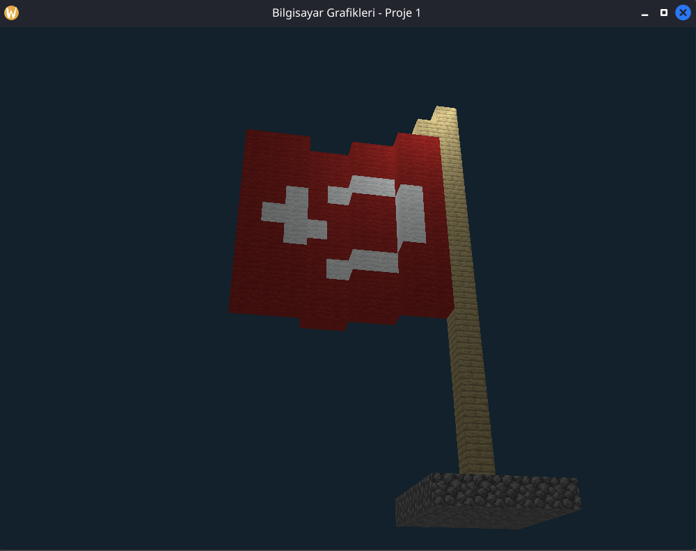

# Bilgisayar Grafikler 1. Proje Ödevi

## Giriş
Bilgisayar Grafikleri 2025 dönemi proje ödevi olarak, ışıklandırma ve primitive şekiller kullanılarak oluşturulan şekillerle sahne yapılmamız istendi. Bu repo ilgili ödevi ve raporu içermektedir.

## Tanıtım Videosu
[![Watch the video]](Video/Video.mp4)

## 3 Farklı Kamera Açısından Görüntü




## Teknik Detay
Teknik detaylar (class içerikleri, açıklamalar) için Rapor.pdf' i inceleyiniz. Readme içerisinde teknik detaya yer verilmeyecektir, programı çalıştırma ve kişisel güncellemeler hakkında detay verilecektir.

## Compile Etmek
Compile etmek için 2 seçenek vardır. Ya Makefile kullanılarak doğrudan compile edilir ya da manuel olarak komut yazılır.
```bash
# makefile ile doğrudan çalıştır
make run

# manuel olarak compile et
g++ -I glad/include  *.cpp glad/src/glad.c -lglfw -ldl -o main
```

## Texture ve Blok eklemek
- İlk olarak ilgilendiğiniz Minecraft Blok Texture' unu [minecraft.wiki](https://minecraft.wiki/w/Category:Block_textures) üzerinden seçip indirin ve Resources klasörü içerisine koyun.

- Sonrasında Headers/Objects.h içerisinde kendinize uygun olarak vertice ekleyin. Örneğin dosya içerisinde glassVertices' e bakarsak verilen Texture' u küpün 6 yüzünede çizen ve başlangıç noktamızda bulunan bir küp görüyoruz. İlgili offset değerleriyle küplerimizi x, y, z eksenlerinde öteleyebiliriz. Blokların tam oturması için ilgili eksenlerde birer birim hareket yapılmalıdır. Örnek:
```cpp
// offset_x tüm konum matrisleri ile toplanır veya çıkarılır.
glm::vec3 offset_x(1.0f, 0.0f, 0.0f);
Vertex diamondVertices[] =
{ 
    Vertex{glm::vec3(-0.5f, -0.5f, -0.5f) - offset_x, glm::vec3(1.0f, 1.0f, 1.0f), glm::vec3(0.0f, 0.0f, -1.0f), glm::vec2(0.0f, 0.0f)},  // Bottom-left
    Vertex{glm::vec3( 0.5f, -0.5f, -0.5f) - offset_x, glm::vec3(1.0f, 1.0f, 1.0f), glm::vec3(0.0f, 0.0f, -1.0f), glm::vec2(1.0f, 0.0f)},  // Bottom-right
    /*...... Devamı için kodu incele*/
};
```

- Sonrasında main.cpp içerisinde aşağıdaki şekilde Textureların tanımlı olduğu yere gelip kendi Texture' unuzu ekleyin. Unutmayinki bazı Texturelar (cam) RGBA iken bazıları RGB' dir. Eğer Texture hatalı gözüküyorsa bunu göz önünde bulundurun.
```cpp
// Resources/<texture>
Texture woolTextures[]{Texture("Resources/wool.png", "diffuse", 0, GL_RGB, GL_UNSIGNED_BYTE)};
std::vector <Vertex> woolVerts(woolVertices, woolVertices + sizeof(woolVertices) / sizeof(Vertex));
std::vector <Texture> woolTex(woolTextures, woolTextures + sizeof(woolTextures) / sizeof(Texture));
Mesh woolCube(woolVerts, cubeInd, woolTex);
```

- Son olarak main loop içerisinde ilgili cismi çizin:
```cpp
// Draws different meshes
coalCube.Draw(shaderProgram, camera);
		
// draw transparent textures like glass
glEnable(GL_BLEND);
glBlendFunc(GL_SRC_ALPHA, GL_ONE_MINUS_SRC_ALPHA);
glassCube.Draw(shaderProgram, camera);
glDisable(GL_BLEND);
```

